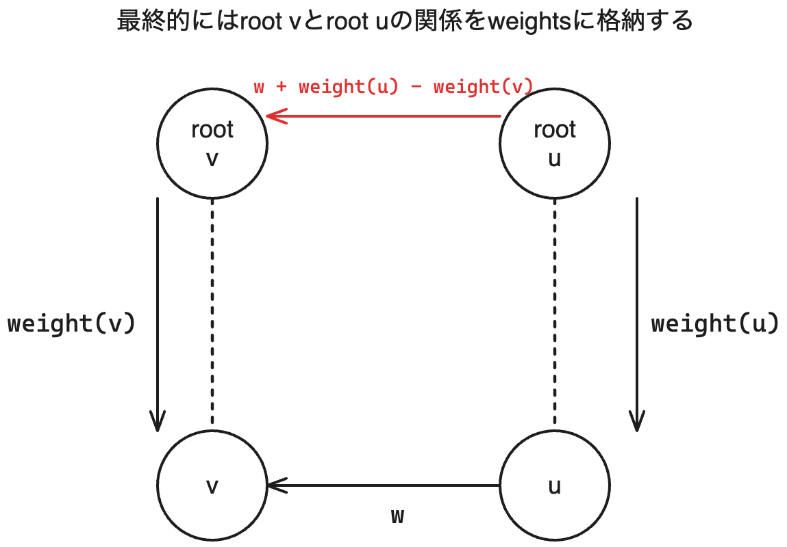

### Weighted Unionfind Solution（重み付きUnionfind）
#### Intuition & Approach
- 同じグループにいる要素同士は比較が可能。グループを管理するUnionfindが必要であることがわかる。
- 同じグループ内での重みに関してはどこかを基準にする必要がある。
  - 根からを基準とすると管理と計算が可能となる。
  - ```roots```同様に```weights```という根を基準とした重みを記録する配列を保持しておく。（**```roots```同様に```weights```も途中状態を含むことに注意！**）
  - rootで根を再帰的に求めると同時にweightsに関しても再帰的に累積を計算する。

#### [Code](./B-Weighted_Union_Find_Trees.py)
```python
from sys import stdin


class WeightedUnionfind:
    def __init__(self, N):
        # ノードiの根ノードを記録（途中状態も含む）
        self.roots = [i for i in range(N)]
        self.ranks = [1 for _ in range(N)]
        # 根を基準としたときの重みを記録（途中状態も含む）
        self.weights = [0 for _ in range(N)]

    def root(self, u):
        roots = self.roots
        if roots[u] == u:
            return u

        # この時点でroots[u] != uなので途中状態を意味する
        root, weights = self.root, self.weights
        # rootsを再帰的に更新しながら、根のノードを求める
        r = root(roots[u])
        # 重みを累積していく
        weights[u] += weights[roots[u]]

        roots[u] = r
        return roots[u]

    # ノードuの所属する木の根を基準としたときのノードuの重み
    def weight(self, u):
        # これを実行することでノードuから根の経路上での途中状態をなくす
        self.root(u)
        return self.weights[u]

    # weight(y) - weight(x) = wとなる様にノードu, vをuniteする
    # u, vをuniteして矛盾するかを返す
    def unite(self, u, v, w):
        root, weight = self.root, self.weight

        root_u, root_v = root(u), root(v)
        if root_u == root_v:
            if weight(v) - weight(u) != w:
                # 既存の条件と矛盾
                return False
            return True

        # (1)
        # uとvそれぞれについて根との重み差分を補正
        w += weight(u)
        w -= weight(v)

        u, v = root_u, root_v

        ranks, roots, weights = self.ranks, self.roots, self.weights

        # uの方がランクが高くなる様にu, vをスワップする
        # これによってvをuにくっつける操作となる
        if ranks[u] < ranks[v]:
            u, v = v, u
            # u, vをスワップしたのでwを反転する必要がある
            w = -w
        elif ranks[u] == ranks[v]:
            ranks[u] += 1

        roots[v] = u
        weights[v] = w

        return True

    def diff(self, u, v):
        root, weight = self.root, self.weight
        return root(u) == root(v), weight(v) - weight(u)


n, q = map(int, input().rstrip().rsplit())
wuf = WeightedUnionfind(n)

while q:
    query = input().rstrip().rsplit()
    com, u, v = int(query[0]), int(query[1]), int(query[2])
    if com == 0:
        w = int(query[3])
        wuf.unite(u, v, w)
    else:
        is_same, d = wuf.diff(u, v)
        if is_same:
            print(d)
        else:
            print("?")

    q -= 1

```

(1)の部分いついてわかりづらいと思いますが要は以下のベクトル図の様なことです。 
w = w + weight(u) - weight(v)がroot uとroot vの間での重みの関係となることがわかります。


#### 計算量
- Time complexity: O(q)

各queryの操作はO(α(n)) = O(1)なので全体でO(q)


- Space complexity: O(n)

WeightedUnionfindに必要な管理データがO(n)
